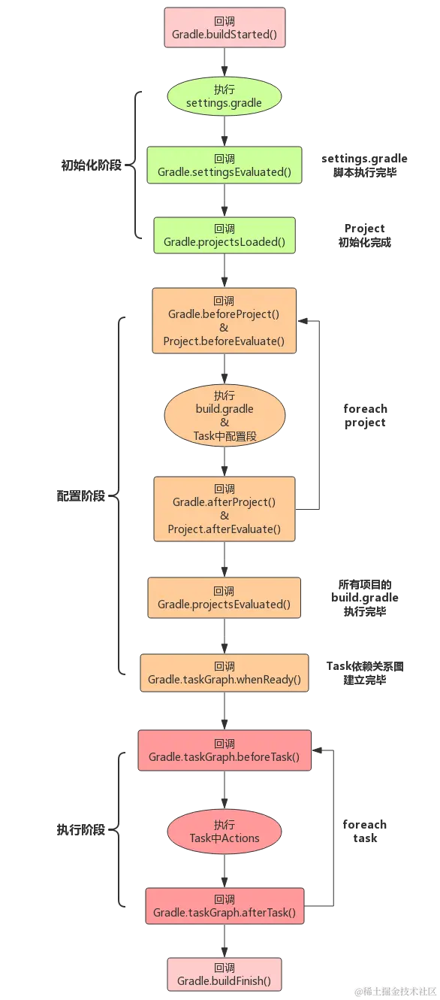

- [构建的生命周期](./src/main/java/com/wlchen/sample/LifcycleTask.kt)

- [task的输入和输出](./src/main/java/com/wlchen/sample/InOutTask.kt)
- [插件或者任务中使用文件](./src/main/java/com/wlchen/sample/UseFileTask.kt)
- [使插件可配置](./src/main/java/com/wlchen/sample/ExtensionTask.kt)